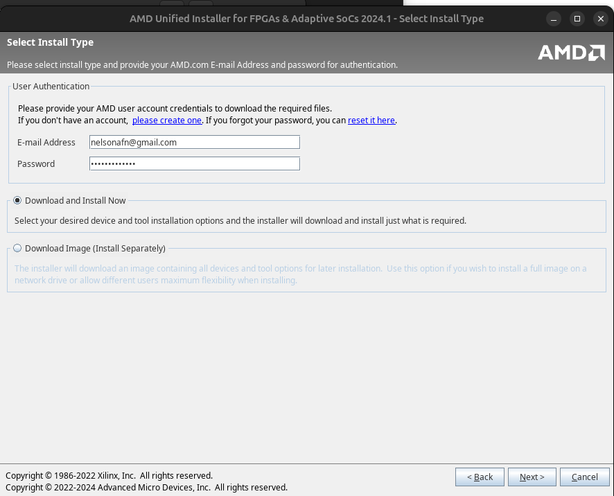

# SystemVerilog Labs – Design and Verification

This repository contains my solutions to the course laboratories **Systemverilog for Design and Verification**.

The purpose of these laboratories is to explore the main features of Systemverilog language focused on both hardware modeling and functional verification.

## Installing Vivivado

### First: Creating a Symbolic Link for `libtinfo5`

If **Lunar Universe** is unavailable, another option is to create a symbolic link from `libtinfo5` to `libtinfo6`.

### 1. Check if `libtinfo5` is Installed

Open your terminal and run: 

    dpkg -l | grep libtinfo5 

This command checks if the libtinfo5 package is installed on your system. If installed, it will display package details. If not, there will be no output. 

### 2. List Existing libtinfo Libraries 

Run the following command: 
 
    ls /usr/lib/x86_64-linux-gnu/libtinfo.so* 

This command lists all versions of the libtinfo library available in your system. 

If you see libtinfo.so.6 but not libtinfo.so.5, you need to create a symbolic link to resolve the issue. 

### 3. Create a Symbolic Link for libtinfo.so.5 

If libtinfo.so.5 is missing, create a symbolic link pointing libtinfo.so.5 to libtinfo.so.6 by running: 

    sudo ln -s /usr/lib/x86_64-linux-gnu/libtinfo.so.6 /usr/lib/x86_64-linux-gnu/libtinfo.so.5 

This creates a soft link, allowing applications that depend on libtinfo.so.5 to use libtinfo.so.6 instead. 

### 4. Verify the Symbolic Link 

To ensure the link was created correctly, run: 

     ls -l /usr/lib/x86_64-linux-gnu/libtinfo.so.5 
 
You should see output similar to: 

    lrwxrwxrwx 1 root root 25 Aug  7 12:00 /usr/lib/x86_64-linux-gnu/libtinfo.so.5 -> /usr/lib/x86_64-linux-gnu/libtinfo.so.6 
 
This confirms that libtinfo.so.5 now correctly links to libtinfo.so.6 

## Installation

Download Vivado AMD Unified Installer for FPGAs & Adaptive SoCs 2024.1: Linux Self Extracting Web Installer from https://www.xilinx.com/support/download.html 

Add execution permit 

    chmod +x Downloads/FPGAs_AdaptiveSoCs_Unified_2024.1_0522_2023_Lin64.bin 

Start the download  and installer app 

    sudo Downloads/FPGAs_AdaptiveSoCs_Unified_2024.1_0522_2023_Lin64.bin 

If you are using lates Ubuntu version, you will get this warning 

**If you get this warnings, please do these steps Before Installation  (Web view)** 
 
Install Vivado Free for tests without support for some devices 

    sudo tools/Xilinx/Downloads/2024.1/xsetup

Select packages  

**Agree with terms** 

**Select installation destination** 

    /opt/Xilinx 

**Advance to installation** 

After installation, run script to install aditional libs if requested 

    sudo /opt/Xilinx/Vitis/202*.*/scripts/installLibs.sh 

For Ubuntu 24.04 or newer: 

Open the new file for storing the sources list 

     sudo nano /etc/apt/sources.list.d/ubuntu.sources 
 

Paste in the following at the end of the file: 

    Types: deb 
    URIs: http://archive.ubuntu.com/ubuntu/  
    Suites: lunar 
    Components: universe 
    Signed-By: /usr/share/keyrings/ubuntu-archive-keyring.gpg 
  

Save the file and run  

    sudo apt update  

And install command  

    sudo apt install libtinfo5 

    sudo apt install libncursesw5 

Warning: setlocale 

If you get any error like "warning: setlocale: LC_ALL: cannot change locale (en_US.UTF-8)", please do 

    sudo apt clean && sudo apt update 

    sudo apt install locales 

    sudo locale-gen en_US.UTF-8

Generating locales (this might take a while)... 

  en_US.UTF-8... 

  done 
Generation complete 

## After Instalation

**Vivado/Vits Source** 

To use Vivado, do the source of their paths  (It can be added into your ~/.bashrc) 

 
    source /opt/Xilinx/Vivado/202*.*/.settings64-Vivado.sh 

Run Vivado application standalone 

    vivado 

 
### To create a Vivado icon on Ubuntu Desktop 

    nano ~/.local/share/applications/vivado.desktop 

Inside the nano paste this command 

    [Desktop Entry] 

    Version=1.0 

    Type=Application 

    Name=Vivado 

    Exec=bash -c "source /opt/Xilinx/Vivado/202*.*/.settings64-Vivado.sh && vivado" 

    Icon=/opt/Xilinx/Vivado/202*.*/doc/images/vivado_logo.png 

    Terminal=false 

    Categories=Development;EDA; 

    Comment=FPGA Design Suite 

Save and exit 

    chmod +x ~/.local/share/applications/vivado.desktop 

Now search the Vivado icon on Ubuntu desktop 

## Repository structure

Cada diretório representa um laboratório específico, abordando conceitos e práticas como:

- Modelagem de registradores, multiplexadores, contadores e ALUs
- Implementação de máquinas de estado
- Criação de testbenches com interface, clocking blocks e randomização
- Cobertura funcional
- Testes e simulações utilizando a ferramenta Vivado

## List of laboratories

- Lab 1. Modeling a Simple Register
- Lab 2. Modeling a Simple Multiplexor
- Lab 3. Modeling a Simple Counter
- Lab 4. Modeling a Sequence Controller (FSM)  
- Lab 5. Modeling an Arithmetic Logic Unit (ALU)  
- Lab 6. Testing a Memory Module 
- Lab 7. Using a Memory Interface  
- Lab 8. Verifying the VeriRISC CPU (VeriRISC)  
